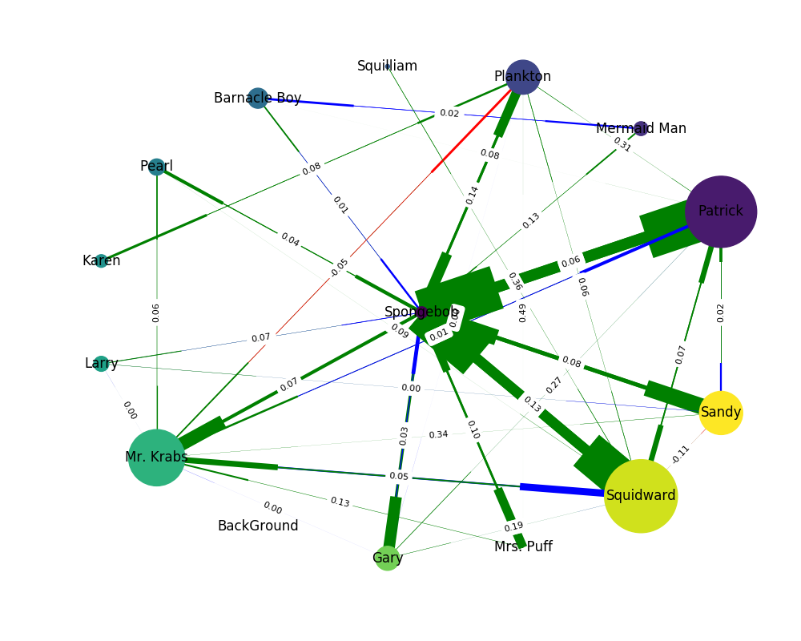

# SpongeBob_NLP

Natural Language Processing of SpongeBob transcripts
---------------------------------------------------
SpongeBob SquarePants is an American animated television series created by marine biologist and animator Stephen Hillenburg. Frist broadcasted in 1999, it presents diverse social interactions and dynamics between its characters. In this project, we model the style of interaction by extracting the main topics from the conversations and distinguish the sentiment of each conversation. Finally, we place these parameters on a graph to visualize the results.

____________________________________________________
The project includes four Python files:
* Topic Modeling  - Extracts topics from text, and presents them visually using the pyLDAvis Python package.
* Sentiment Analysis - Analyzes the sentiment of the SpongeBob characters and clasisfies them to their sentiment.
* Character Clustering - Cluster the character in the text conversations to communitites, using the K-means and DBSCAN clustering algorithms.
* Interaction and Social Networks - Build the social network and visualize it.

Example social network:

•	Vertices – Each character entity was assigned to a vertex in the graph. We only included nodes corresponding to character with a “PERSON” POS tag count of at least 2.

•	Edges – Each conversation (between two characters) is assigned a directed edge. The direction of the edge is used to indicate the overall sentiment of the sentences spoken by a character to another charact.
